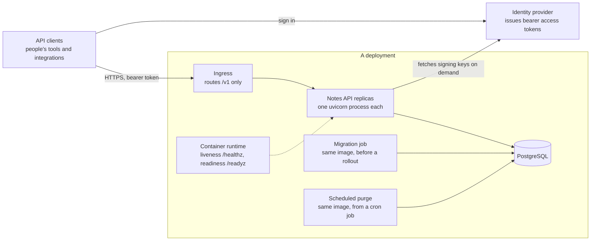
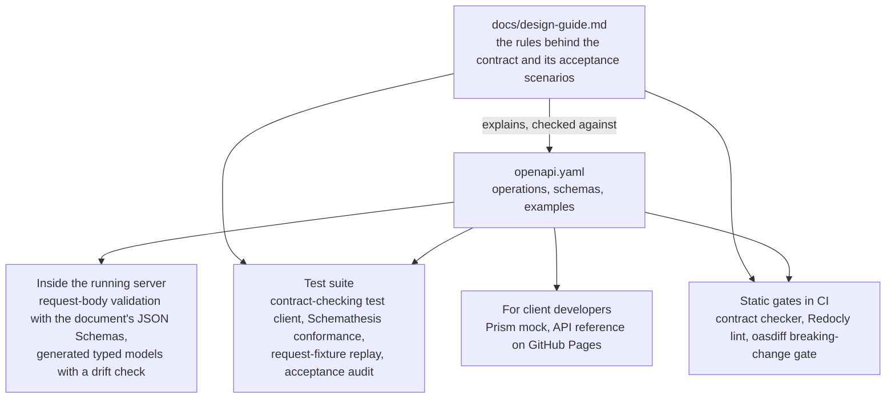
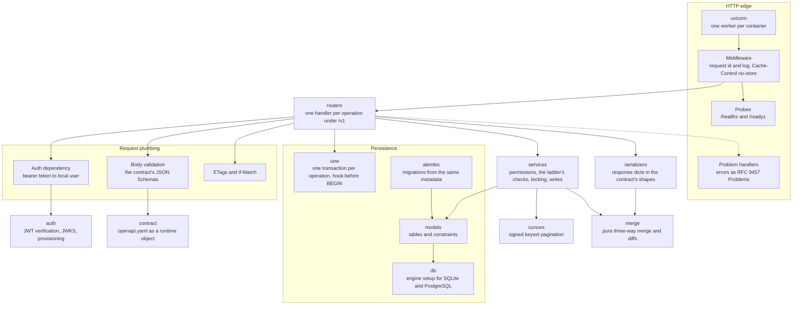
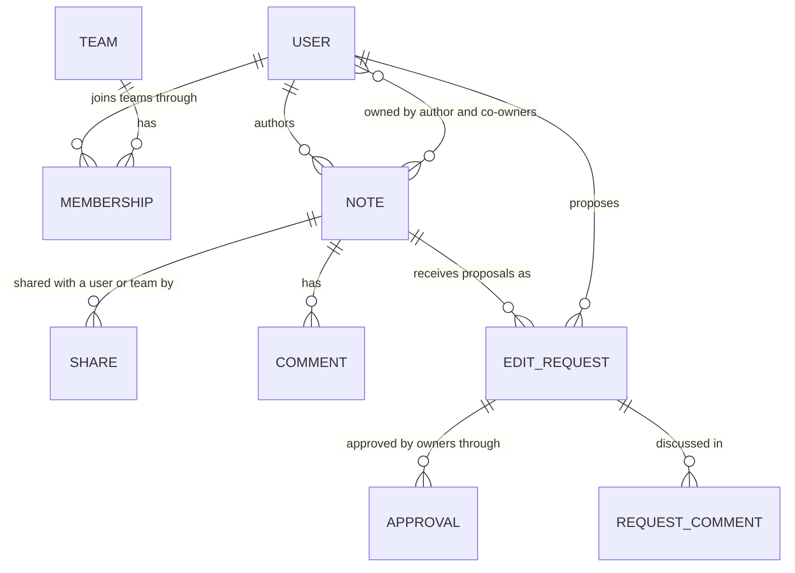
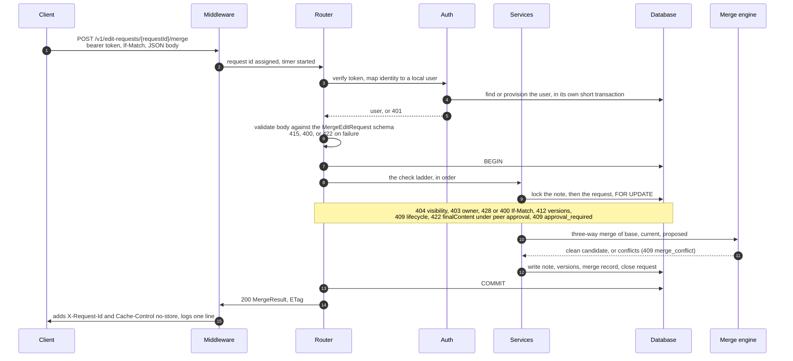
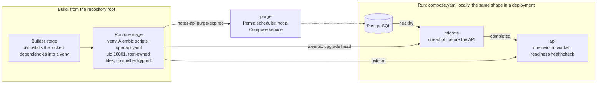

# Notes API architecture

This document explains the Notes API at a high level: what surrounds the service, how the OpenAPI contract drives the server's validation, the tests, the CI gates, the mock, and the published reference, how the server is put together, how one request travels through it, and how the result is packaged and run. Each numbered section pairs a diagram with a short explanation; section 3 has two. The detailed rules live elsewhere: [`openapi.yaml`](openapi.yaml) and [the design guide](docs/design-guide.md) define the behaviour, [server/README.md](server/README.md) describes the implementation and its operations, and [AGENTS.md](AGENTS.md) turns both into working conventions.

Two design choices shape everything below: contract-based development and container-first delivery. The contract comes first: the document is the source of truth, and the server, the tests, the mock, the published reference, and the CI gates all consume it. The container image is the unit of delivery: one image serves the API, applies migrations, and reclaims storage, and CI builds, scans, smoke-tests, and exercises that image in addition to running the host-based checks and test suites. The reasoning behind both choices is in the [README](README.md#two-design-choices).

The repository holds two toolchains. The contract side lives at the root: the document, the design guide, the static checker and its fixtures, with pip and Node tooling. The server side lives under `server/` as a uv project with its own tests and scripts. The [repository layout](README.md#repository-layout) lists every path.

## 1. System context

The service is a REST backend for notes shared among several small teams in one workspace. Clients call the operations under `/v1` with a bearer access token issued by an identity provider outside the service; in development the image's own issuer command plays that role. The server exposes no login endpoint. It checks the token's type header, verifies the signature (RS256 or ES256), issuer, audience, required claims, and time claims, then maps the verified issuer and subject to exactly one local user, provisioning that user on first contact. Teams, memberships, notes, shares, comments, edit requests, and approvals belong to this service, as does the local user directory keyed by issuer and subject. Authentication does not.

Everything persistent lives in PostgreSQL. SQLite appears only in tests and verification scripts. Every test that touches a database gets a fresh one: a SQLite file in its temporary directory, or the PostgreSQL database named by the test database URL with its schema dropped and recreated, which is how CI runs the suite a second time. Two more processes share the API's image: a one-shot migration job that brings the schema to head before a rollout, and a purge command that an external scheduler runs to reclaim storage from trashed notes whose retention has ended. Expiry itself is enforced at read time, so the purge is housekeeping rather than a correctness step.

The two probe paths, `/healthz` and `/readyz`, sit outside `/v1` and outside the contract. They are unauthenticated and exist for the container runtime, so the ingress must not route them. Liveness has no dependencies, so a database incident never restarts the fleet. Readiness pings the database, so a replica with dead connections stops receiving traffic until they recover.

The server does not send email, publish events, or render Markdown to HTML. Content is stored and returned as Markdown source, and rendering it safely is the client's job.

## 2. The contract and its consumers

The contract's first two releases preceded the server, and the server follows the document rather than the other way round. FastAPI's own OpenAPI generation and documentation pages are switched off, so the server publishes no description of its own and `openapi.yaml` is the only machine-readable description of the API.

Inside the server, the document is loaded at startup and its JSON Schemas validate every request body, producing the contract's field-error shape with one RFC 6901 pointer per offending field. The typed models generated from the document are a convenience for handlers, not the body validator: the generator cannot express every constraint the schemas use, so the schemas keep the authority and a drift check keeps the committed models equal to a fresh generation.

In the test suite, a wrapper around the test client maps each response back to the route template that served it and fails the test on an undeclared status, an off-schema body, a missing required header, or a wrong media type. Schemathesis generates valid and invalid requests for every operation the document declares. Every must-fail and must-pass fixture for a request-body schema in [`tests/negative_cases.yaml`](tests/negative_cases.yaml) is replayed through the endpoint that uses it; fixtures for response schemas are covered by the loader test and by the contract-checking client on every response. An audit fails when any acceptance row of the design guide lacks a tagged test.

Outside the server, a static checker keeps the spec, the guide, and the fixtures consistent, Redocly lints the document, and oasdiff fails a pull request that would break existing clients unless it carries the label reserved for deliberate breaks. The same document is served by Prism as a stateless mock for client work and rendered by Redocly into the published API reference. The compatibility rules behind the gate are the contract's own: `/v1` is the client compatibility line, `info.version` is the document's semantic version, each release is an annotated tag with a [changelog](CHANGELOG.md) entry, and a deliberate break ships under a new prefix. [Releases and versioning](README.md#releases-and-versioning) spells this out.

A schema-valid response can still carry a business-rule bug. Authorization, atomicity, ownership, and the merge algorithm are proved by the acceptance and race tests, not by the schemas; section 4 describes the race tests and the hook seam behind them.

## 3. Server module layout

The server is a Python 3.12 application under `server/`, built on FastAPI, SQLAlchemy 2, and Alembic, and it is deliberately synchronous: handlers are plain functions in FastAPI's threadpool, and the database layer is the ordinary SQLAlchemy session. Every operation is registered directly on the application with the `/v1` prefix, and handler names follow the contract's operation identifiers. The diagram groups modules by role rather than by package.

The layers have fixed jobs. Routers translate HTTP into service calls: they resolve the caller through the auth dependency, which runs its own short lookup transaction, read and validate the body, open one fresh session and one transaction, call the service functions in the ladder's order, and hand the result to a serializer. Services hold the business rules: permission resolution, the ladder's checks from visibility onward, row locking, and every write; the routers read `If-Match` through the ETag module for the precondition rung. Serializers build response bodies as plain dicts in the contract's shapes, which the test harness validates on every request, and compute the diffs an edit request shows. The merge engine is a pure package with no database or HTTP imports, specified by the design guide and pinned by the contract's own diff examples as byte-exact fixtures.

Cross-cutting concerns each have one home: the contract module loads the document once and caches validators, the ETag module issues one opaque strong tag per resource version and enforces the `If-Match` rules, the cursor module signs keyset cursors and binds them to the caller and the query, the auth package verifies tokens and provisions users, an injected clock makes timestamps and expiry deterministic in tests, and configuration is read from the environment by a process that refuses to start when a required setting is missing, naming the variable and never its value.

### The core model

The data model is the design guide's [core model](docs/design-guide.md#1-core-model) as tables, one per entity above plus a table for each note's ordered tags. Enumerations are plain strings guarded by CHECK constraints, so the schema is identical on both databases, and each note, comment, edit request, and request comment carries a version column that backs its ETag. An edit request stores the base snapshot it was proposed against, the proposal, and the merge record; diffs are computed on read, never stored. Parent-to-child foreign keys cascade, so deleting a team removes its memberships and purging a note removes everything that hangs off it, while shares addressed to a deleted team are removed by the service.

Ownership is the domain's central invariant, and the schema and the services enforce it rather than merely record it. The share table has no write flag: shares grant only `read`, `comment`, and `propose_edit`. A note with more than one owner is protected: the notes service refuses direct content edits, and even its owners' changes go through edit requests, where the note's review policy decides whether one owner may merge alone or peers must approve first.

## 4. One request through the server

The diagram follows the richest operation, merging an edit request, because it touches every layer but pagination. Simpler operations run the same path with fewer rungs.

Every handler resolves its checks in the same order, so the same request always gets the same answer and nothing leaks to a caller who may not see the resource. First the caller: `401` for a missing or invalid token, then `422` for a malformed path or query parameter. Then the body, before any transaction: `415`, `400`, or `422` with field errors from the schema. Then, inside one transaction: `404` for anything the caller cannot see, including a child reached through the wrong parent; `403` for a forbidden action on a visible resource; `428` or `400` for a missing or malformed `If-Match`; `412` for a stale version, before any lifecycle check; `409` for the lifecycle; semantic `422` that needs resource state; business `409` such as a duplicate, a missing approval, or a merge conflict; and finally the write and the response with the new `ETag`. Team memberships and note shares are visible only to members and owners, so for those nested targets the permission check comes before the target lookup and a caller cannot probe who belongs to a team. The full list with every Problem code is the server README's [check ladder](server/README.md#the-check-ladder).

Lock order is always note, then edit request, then child row, and team, then membership; team-scoped mutations never lock a note row and note-scoped mutations never lock a team row, so no cycle exists. Every note-scoped mutation locks the note row even when it does not write the note, and a mutation whose authorization came from a share or a membership also locks those rows, so a revocation that wins the race prevents the mutation from committing. On PostgreSQL these are `FOR UPDATE` and `FOR SHARE` selects; on SQLite the engine emits `BEGIN IMMEDIATE` at the start of every transaction and serializes writers instead.

The unit-of-work wrapper calls a hook immediately before each transaction begins. In production the hook does nothing. Race tests replace it with a competitor that commits first, usually through its own API request, which proves that every check a service makes lives inside its transaction: a merge whose request was revised in the hook gets `412`, and a PATCH on a note that gained a second owner in the hook gets `409`. Thread-and-barrier tests cover the true-concurrency cases and run unchanged against PostgreSQL in CI.

Errors raised anywhere on this path become the contract's Problem Details through one set of handlers, including FastAPI's own parameter errors and unknown routes, so every error the server raises on purpose is a status the contract declares; only the last-resort `500` for an unexpected exception, which carries no detail, is undeclared. Every response carries `Cache-Control: no-store`, and the request log is the server's only telemetry: one redacted JSON line per request, probes excepted, with the request id, matched route, status, Problem code, caller id, and duration, never the query string, headers, or bodies. A well-formed `X-Request-Id` from the caller is kept and echoed for correlation; there is no metrics endpoint and no tracing.

## 5. Delivery: one image, three commands

This is the container-first delivery the README describes. The image is built from the repository root because the server needs `openapi.yaml` at runtime. A builder stage installs the locked dependencies and the project into a virtual environment with uv; the runtime stage, on the same digest-pinned Python base, copies that environment together with the Alembic scripts and the contract, applies Debian's security updates, and runs as a non-root user that owns nothing in the image. There is no shell entrypoint, no uv, and no test tooling inside it. Dependabot proposes base-image updates weekly, holding the lines that must move deliberately.

The same image plays three roles by command. Started with its default command it runs one uvicorn worker serving the API, and it is scaled with replicas that share no state beyond the database and the cursor signing key they are all configured with. Started with `alembic upgrade head` it migrates the schema as a one-shot job before the rollout that needs it, never at process start, where replicas would race; because old and new replicas share the schema during a rollout, a migration must stay compatible with the image still running. Started with `notes-api purge-expired` it reclaims storage from expired trash. Migrations and purge need only the database URL; the API additionally requires the identity provider settings and the cursor signing key, and refuses to start without them.

`compose.yaml` is the complete local deployment and the reference for a real one: PostgreSQL becomes healthy, the migration runs to completion, then the API starts and reports readiness through its own probe. Both application services run with a read-only root filesystem, all capabilities dropped, no privilege escalation, and a tmpfs at `/tmp`, which is the posture a Kubernetes security context should state. Because the stack has no identity provider, the image also carries a development issuer that generates a key pair, prints the settings the stack reads, and mints tokens; a deployment configures a real provider through a JWKS URL and never uses it.

Continuous integration runs four workflows on every push to `main` and every pull request. The Container image workflow verifies the built artifact rather than a host installation:

| Workflow | What it proves |
| --- | --- |
| Contract checks | The static checker and the Redocly lint pass; on pull requests, oasdiff finds no client-breaking change against the base branch unless the request carries the `breaking-change` label. |
| Server checks | Ruff, strict mypy, and the full test suite pass on SQLite and again against a PostgreSQL service container, the only run that exercises the production dialect's row locks. |
| Container image | hadolint and the Compose configuration pass, the image builds, Trivy finds no fixable critical or high vulnerability, the smoke test proves the container contract, and the curl harness exercises every operation against the built image. |
| API reference | The reference builds from the document on every run and is published to GitHub Pages on pushes to `main`. |

The smoke test and the end-to-end harness run in disposable Compose projects that never touch the developer's own stack. The image is built and verified on every push to `main` and every pull request but is not yet published to a registry.

## 6. Qualities this architecture provides

- **One enforced source of truth.** The contract validates request bodies at runtime, checks every response in the test suite, drives conformance and fixture replay, gates pull requests, and produces the mock and the reference. Under `/v1`, behaviour the document does not describe is treated as a bug.
- **Uniform error handling that hides what the caller may not see.** One check ladder in every handler, one Problem shape for every declared error, and `404` for anything the caller may not know exists. The order is documented and pinned by tests.
- **Correctness under concurrency by construction.** One transaction per operation, a fixed lock order, authorization rows locked alongside the write, and a hook seam that lets tests prove every service check is inside the transaction, deterministically on SQLite and against real row locks on PostgreSQL.
- **Clear internal boundaries.** Routers, services, serializers, and a pure merge engine have single jobs; the merge algorithm is tested against the contract's examples without a database or an HTTP client.
- **Ownership enforced by the server.** No share can grant write, protected notes refuse direct content edits, and peer approval requires distinct owners, so the product's central promise does not depend on client behaviour.
- **A verified delivery artifact.** The image CI tests is the image a deployment runs: non-root, digest-pinned, scanned, smoke-tested, exercised end to end, and run read-only, with migrations separated from startup and configuration that fails fast without leaking secrets.
- **Defence in depth for data exposure.** `Cache-Control: no-store` on every response, signed and caller-bound cursors, redacted request logs, and probes kept outside the public prefix.

## Where to read next

- [openapi.yaml](openapi.yaml): the contract itself; operation descriptions and schemas are normative.
- [docs/design-guide.md](docs/design-guide.md): the model, permissions, edit requests and merges, lifecycle, HTTP conventions, and the acceptance scenarios.
- [README.md](README.md): the two design choices, the ownership rationale, and how to run the checks, the mock, and the server.
- [server/README.md](server/README.md): the check ladder, versions and locking, the test harness, behaviour by resource, and operations.
- [AGENTS.md](AGENTS.md): the conventions to preserve when changing the code.
- [CHANGELOG.md](CHANGELOG.md) and [tasks/plan.md](tasks/plan.md): the release notes and the implementation plan with the defaults it pinned.
