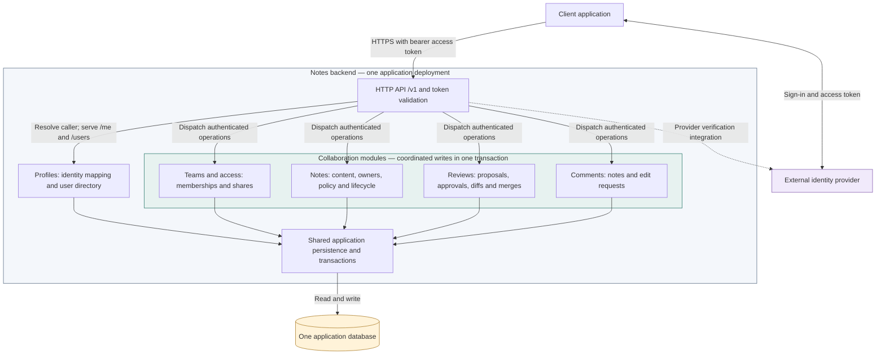

# Notes API architecture

**Status: proposed implementation architecture.** The repository currently contains the API contract and static checks. This diagram follows the recommendation to use an external identity provider and one modular application backend. Framework, database engine, identity provider, and hosting remain undecided.

## Application and module boundaries

The boxes inside the backend are internal modules. They run in the same application deployment and use one database. Arrows show major request and persistence dependencies; responses and internal coordination calls are omitted. Each module owns its data access, and application operations coordinate transactions across affected modules.

The dotted identity-provider connection represents the selected provider's verification integration. JWT verification can use provider keys; opaque tokens can require introspection. The implementation must also apply the configured issuer, audience, expiry, and provider-supported revocation checks. The diagram does not prescribe a provider network call on every request or a particular client sign-in flow.

## Responsibilities

| Boundary | Owns |
| --- | --- |
| External identity provider | Authentication and access-token lifecycle. |
| HTTP API | Token validation, request dispatch, contract validation, HTTP preconditions, response headers, and Problem Details mapping. Authentication establishes the caller; domain authorization remains inside the backend. |
| Profiles | Unique `(issuer, subject)` to local user mapping, first-access provisioning, `GET /me`, and the user directory. Identity is resolved before dispatching any operation that needs a local user. |
| Teams and access | Teams, memberships, shares, and effective permissions based on current local data. Note ownership and lifecycle checks participate in permission decisions. |
| Notes | Content, tags, authorship, co-ownership, review policy, ETags, trash, restoration, and expiry. |
| Reviews | Base snapshots, proposals, approval state, three-way merge, previews, terminal transitions, and merge attribution. |
| Comments | Note comments and edit-request comments, with their distinct visibility and mutation rules. |
| Shared persistence | Module-owned records in one database, with coordinated transactions for operations spanning modules. |

## Transaction guarantees

These requirements determine the collaboration boundary:

- **Merge:** In one transaction, recheck current authorization, approvals, both ETags, and lifecycle; update the note and record the closed request and merge attribution. Any failure leaves both unchanged.
- **Owner removal:** Update ownership and remove that owner's approvals from open requests in the same transaction; advance affected versions.
- **Access revocation:** Serialize affected writes with membership, share, ownership, policy, and lifecycle changes. A permission check performed before the write transaction is insufficient.
- **Trash:** Remove shares and change note lifecycle atomically. Preserved comments and requests become frozen. Expiry is enforced on reads and restoration even before physical cleanup runs.
- **First access:** Provision exactly one local user for each trusted `(issuer, subject)`, including concurrent requests.

Authorization and resource visibility are checked before exposing content, ETags, or conflict details. Conditional writes recheck their preconditions within the write transaction.

## Contract-driven implementation

[`../openapi.yaml`](../openapi.yaml) remains the normative public API. This architecture is an implementation proposal and does not change its routes or guarantees. The [design guide](design-guide.md), especially sections 2, 3, and 6, supplies the behavioral rules and acceptance scenarios.

The existing static validator and Redocly workflow check the contract. Once a backend exists, HTTP acceptance tests must also verify real response schemas, headers, permissions, lifecycle behavior, and concurrent writes against this contract.

A separate Profiles deployment can be reconsidered if multiple applications need the same profile capability. That extraction would require explicit provisioning, user-existence, and outage behavior while preserving the collaboration transaction boundary shown above.
